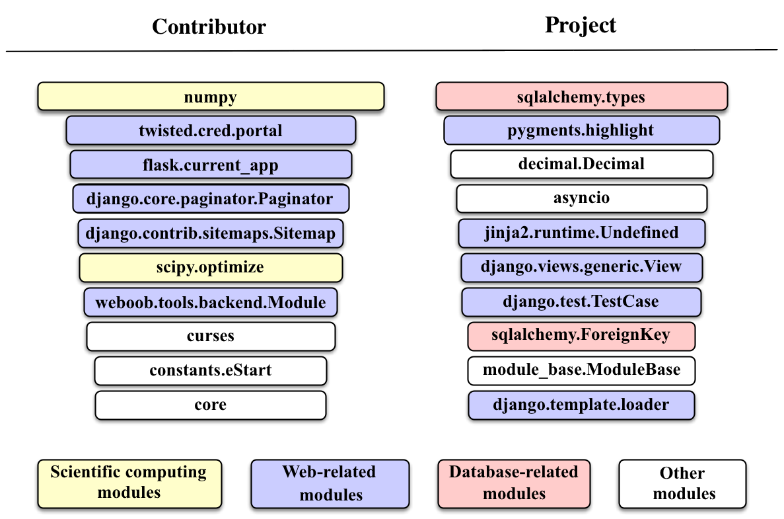

# Ranking Influencers on Social Collaboration Platforms

## Abstract
This paper draws an analogy between recommender systems
and social collaboration platforms and proposes a method to harness
information about users and items to model individual's impact in such collaboration networks.
With this analogy, we quantify social influence by measuring the latent influence of each user-item pair under a unified framework based on factorization machines. 
Experiments conducted on a GitHub dataset attest the effectiveness of the proposed framework in providing better rankings for top influencers than several baseline methods.
In addition, interesting analyses and discussions on the results are also provided in the paper.

## Method
We propose a unified framework to measure influence in collaboration networks by drawing an analogy between recommender systems and these networks.
In particular, we draw an analogy between the conventional user-item relationship in recommender systems and the contributor-project relationship in social collaboration networks.
With this analogy, we quantify influence by measuring the latent influence of each contributor-project relation with an approach based on factorization machines (FM).

## Results
The top 10 weighted Python modules learned from our model are listed in Figure. 
Interestingly, the web development-related modules are the major ones in the table, probably due to the fact the top-ranked contributors focus their development efforts on web-related projects.

